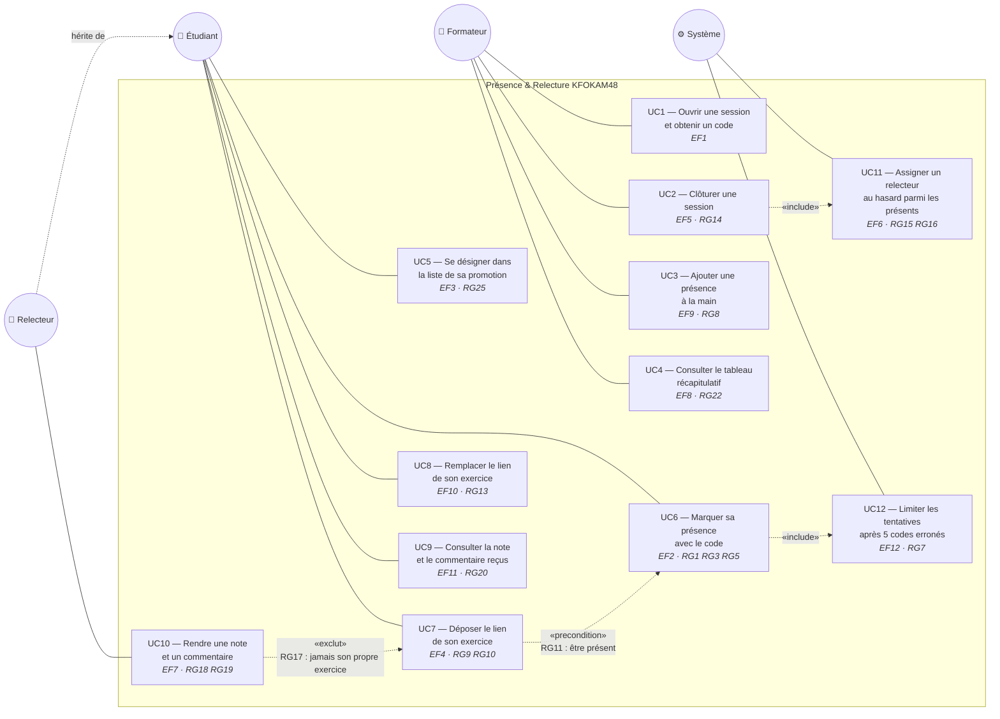

# D1 — Diagramme de cas d'utilisation

> Acteurs et cas d'utilisation de **Présence & Relecture KFOKAM48**.
> Le **relecteur** n'est pas un acteur physique distinct : c'est un étudiant que le système
> a désigné pour relire l'exercice d'un pair (cf. cahier des charges §2). Il est représenté
> séparément parce que ses cas d'utilisation sont distincts, mais il hérite de l'étudiant.

## Lecture

| Acteur | Cas d'utilisation | Remarque |
|---|---|---|
| **Formateur** | UC1 à UC4 | UC2 déclenche systématiquement UC11 : clôturer, c'est assigner (RG14) |
| **Étudiant** | UC5 à UC9 | UC7 suppose UC6 : on ne dépose que si l'on est présent (RG11) |
| **Relecteur** | UC10 | Étudiant assigné par UC11 ; ne peut jamais relire son propre dépôt (RG17) |
| **Système** | UC11, UC12 | Acteur non humain : le tirage du relecteur (Q7) et le blocage après 5 erreurs (Q4) ne sont déclenchés par personne |

**Hors périmètre, donc absents du diagramme :** s'authentifier, gérer les comptes et les promotions, être notifié d'une assignation, exporter le tableau (cahier des charges §3).
