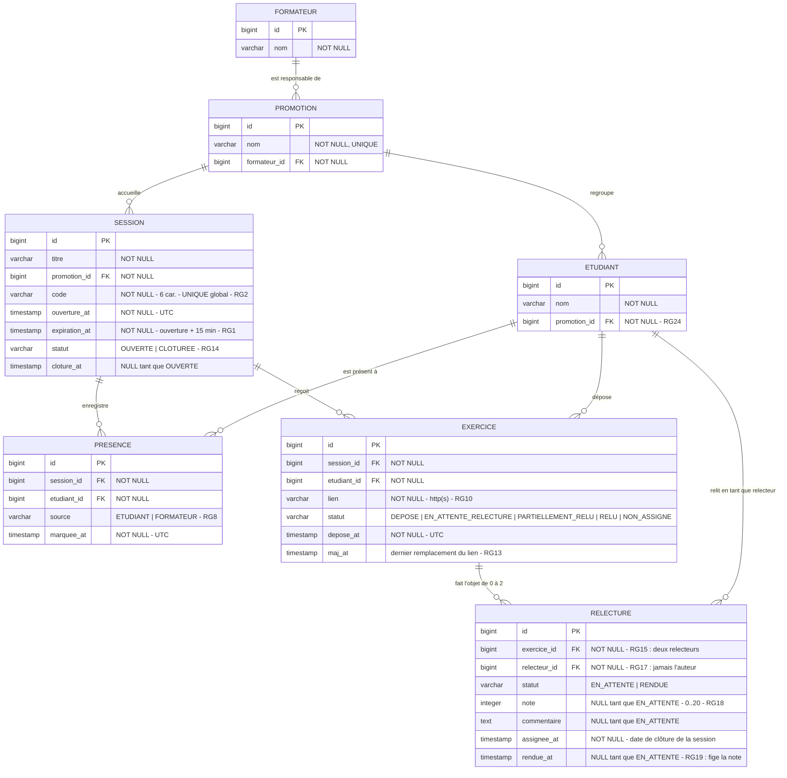

# D2 — Modèle de données

> **Ce diagramme fait foi pour les migrations Flyway.** Toute divergence entre ce schéma et
> `backend/src/main/resources/db/migration/` est un défaut : c'est ce document qu'on corrige
> en même temps que la migration, dans le même commit.
>
> Les migrations vivent dans deux dossiers : `db/migration` pour le schéma et le référentiel,
> `db/demo` pour l'activité de démonstration. Seul le premier décrit la structure ; c'est celui
> que ce diagramme représente.
>
> **Révisé à l'étape 3** (migration V4) : la cardinalité `EXERCICE`–`RELECTURE` passe de `0..1`
> à `0..2`, et le statut `PARTIELLEMENT_RELU` apparaît.

## Contraintes portées par le schéma

| Contrainte SQL | Règle | Pourquoi en base et pas seulement en Java |
|---|---|---|
| `UNIQUE (session_id, etudiant_id)` sur `presence` | **RG3** | Deux requêtes simultanées passeraient la vérification applicative ; seule la base garantit l'unicité. Sa violation est traduite en `409 DEJA_PRESENT` |
| `UNIQUE (session_id, etudiant_id)` sur `exercice` | **RG9** | Même raison. Traduite en `409 EXERCICE_DEJA_DEPOSE` |
| `UNIQUE (exercice_id, relecteur_id)` sur `relecture` | **RG15 révisée** | Depuis l'étape 3, un exercice a **deux** relecteurs différents. L'unicité porte donc sur le couple : deux pairs peuvent relire le même exercice, un même pair ne le relit pas deux fois. Posée par la migration **V4**, qui remplace le `UNIQUE (exercice_id)` de V1 |
| `UNIQUE (code)` sur `session` | **RG2** | Un code ne désigne jamais deux séances. D2 prévoyait initialement un index **partiel** `WHERE statut = 'OUVERTE'`, que **H2 ne sait pas créer** — or les tests d'intégration tournent sur H2 (ENF7). L'unicité est donc **globale** : c'est une contrainte plus forte, qui satisfait RG2 a fortiori. Le coût est de ne jamais réutiliser un code, sans conséquence sur un espace de 32⁶ valeurs |
| `CHECK (note IS NULL OR note BETWEEN 0 AND 20)` | **RG18** | Dernier rempart ; la validation `@Min`/`@Max` reste le premier |
| `CHECK (source IN ('ETUDIANT','FORMATEUR'))` | **RG8** | Le champ `source` du contrat n'accepte que ces deux valeurs |
| `CHECK (statut IN (...))` sur `session`, `exercice`, `relecture` | RG14, RG21 | Les statuts sont stockés en `varchar` et non en type `enum` PostgreSQL, pour rester portable H2 (cahier des charges §8) |
| Index sur `presence(session_id)`, `exercice(session_id)`, `relecture(relecteur_id)` | **ENF2** | Le tableau du formateur agrège par promotion ; sans ces index il balaye tout |

## Décisions de modélisation

- **Pas de table `Relecteur`.** Le rôle est porté par `relecture.relecteur_id`, qui pointe vers `etudiant`. Un même étudiant est auteur d'un exercice et relecteur d'un autre dans la même session.
- **Deux `relecture` sont créées vides à la clôture**, au statut `EN_ATTENTE` (RG14, RG15 révisée). S'il n'existe qu'un seul pair éligible, une seule est créée — et la note qui en sortira sera définitive, pas provisoire (RG26). C'est cette ligne dont l'identifiant alimente `POST /api/relectures/{id}` : l'opération du contrat imposé note une relecture **qui existe déjà**, elle ne la crée pas.
- **`exercice.statut = NON_ASSIGNE`** lorsque aucun relecteur éligible n'a pu être tiré (RG16) : l'exercice n'a alors aucune ligne `relecture`, ce qui justifie la cardinalité `0..1`.
- **La moyenne n'est pas stockée.** Elle est calculée par l'API à la lecture du tableau (RG22), ce qui interdit toute dérive entre une valeur dénormalisée et les notes réelles — et satisfait F3, qui interdit au frontend de la recalculer.
- **Le compteur de tentatives de RG7 n'est pas en base.** Il vit en mémoire côté service, avec une fenêtre de 2 minutes : c'est une donnée volatile, sans valeur historique, et l'écrire en base coûterait une écriture par erreur de saisie.
- **Aucune suppression physique** n'est prévue : rien dans la demande ne permet d'effacer une présence ou un exercice.
