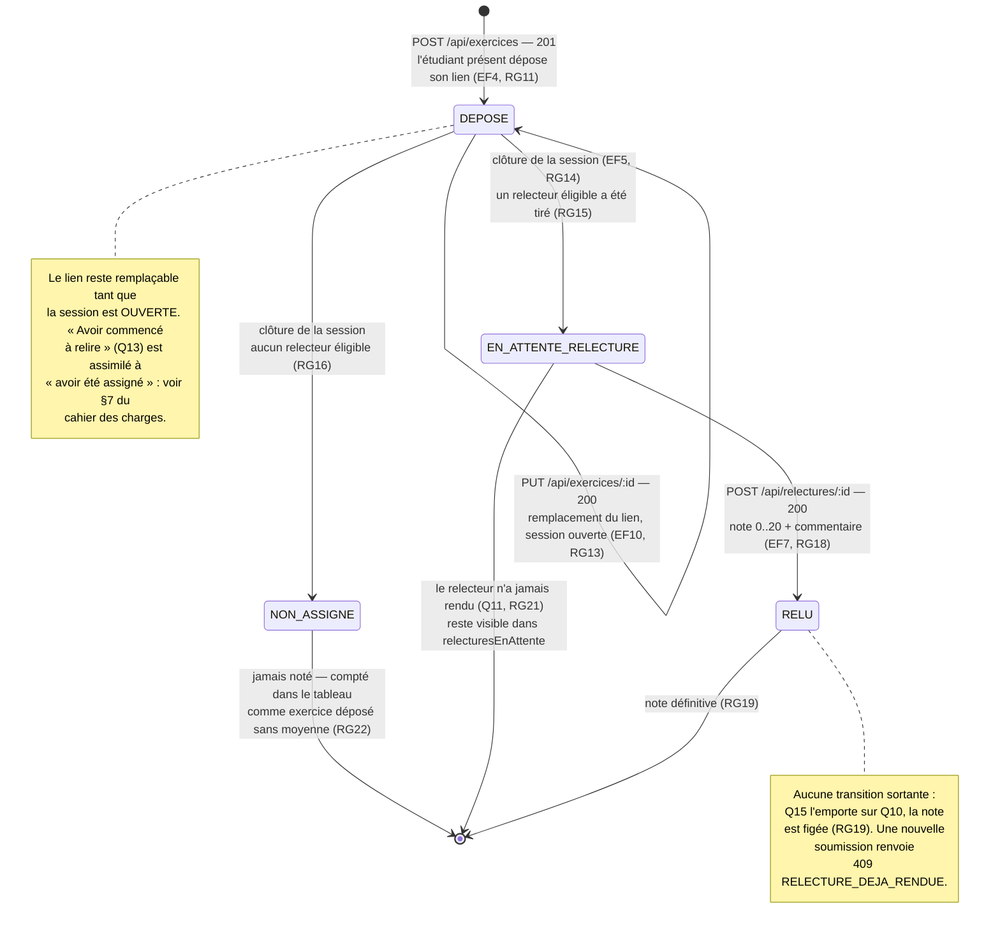

# D4 — États-transitions : cycle de vie d'un exercice

> Diagramme **bonus** (+3 points). Il complète D2 : chaque état correspond à une valeur de
> `exercice.statut`, chaque transition à une opération du contrat d'API.

## Table des transitions

| État de départ | Événement | État d'arrivée | Règle | Réponse API |
|---|---|---|---|---|
| — | Dépôt du lien par un étudiant présent | `DEPOSE` | EF4, RG9, RG10, RG11 | `201 { id, statut }` |
| `DEPOSE` | Remplacement du lien | `DEPOSE` | EF10, RG13 | `200` |
| `DEPOSE` | Clôture de la session, relecteur tiré | `EN_ATTENTE_RELECTURE` | RG14, RG15 | — *(effet de la clôture)* |
| `DEPOSE` | Clôture de la session, aucun éligible | `NON_ASSIGNE` | RG16 | — *(effet de la clôture)* |
| `EN_ATTENTE_RELECTURE` | Relecture rendue | `RELU` | EF7, RG18 | `200` |

## Transitions volontairement impossibles

| Tentative | Réponse | Règle |
|---|---|---|
| Remplacer le lien après la clôture | `409 SESSION_CLOTUREE` | RG13 |
| Déposer un second exercice sur la même session | `409 EXERCICE_DEJA_DEPOSE` | RG9 |
| Noter une relecture déjà rendue | `409 RELECTURE_DEJA_RENDUE` | RG19 |
| Noter l'exercice dont on est l'auteur | `403 AUTO_RELECTURE` | RG17 |
| Noter avec une valeur hors 0–20 ou non entière | `400 NOTE_INVALIDE` | RG18 |
| Revenir de `NON_ASSIGNE` vers `EN_ATTENTE_RELECTURE` | aucune opération ne le permet | RG14 : la clôture est irréversible |

**Lecture pour le formateur :** dans le tableau, un exercice `EN_ATTENTE_RELECTURE` alimente le
compteur `relecturesEnAttente` de son **relecteur**, pas de son auteur (Q16, RG21). Un exercice
`NON_ASSIGNE` n'alimente aucun compteur de relecture : il est seulement compté dans
`exercicesDeposes` de son auteur, et n'entre dans aucune moyenne (RG22).
